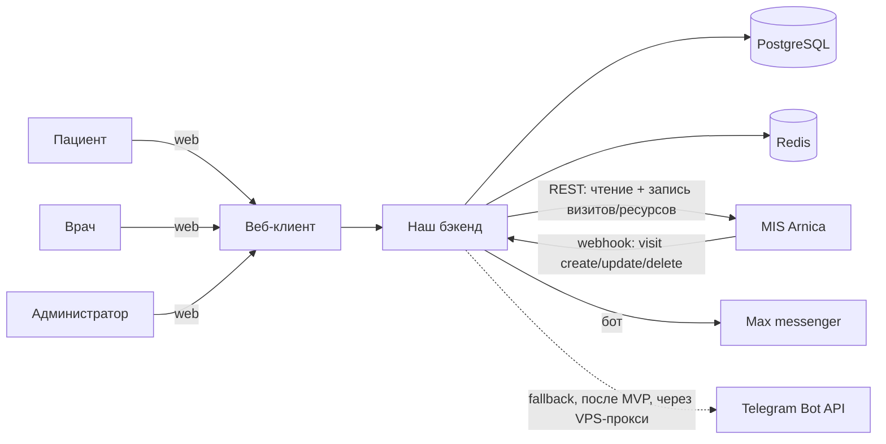

# 03 — Архитектура и стек

> «Как устроено». Статус: 🟡 черновик (стек — на согласование, см. ADR)

## 1. Обзор системы

Веб-приложение поверх MIS Arnica. Наш бэкенд — единственный, кто общается с MIS (хранит интеграционные учётные данные клиники), и поддерживает локальную проекцию данных для скорости и работы при недоступности MIS.

Принципы:
- **MIS — источник истины** по записям. Мы держим **проекцию** (кэш) и обновляем её через вебхуки + периодическую сверку.
- **Двунаправленность:** администратор управляет записями в нашем UI → мы пишем в MIS (`POST/PUT/DELETE /visit`); подтверждение прилетает обратно вебхуком. Админ не пользуется двумя приложениями.
- **Сопоставление пациента** с данными MIS — по номеру телефона.
- **Поэтапный доступ** (тиры T0/T1/T2): медданные открываются только валидированному пациенту.
- Интеграционные секреты MIS хранятся только на бэкенде, на клиента не попадают.

## 2. Контекстная диаграмма



## 3. Компоненты

| Компонент | Ответственность | Технология (предлагается) |
|-----------|-----------------|---------------------------|
| Веб-клиент | UI для ролей, адаптив, 3D-лендинг | Next.js + TS + Tailwind + R3F |
| API/бэкенд | Бизнес-логика, авторизация, API для фронта | NestJS + TS + Prisma |
| MIS-интегратор | Клиент к API MIS, приём вебхуков, синхронизация | модуль бэкенда |
| Планировщик/воркеры | Фоновая синхронизация, отправка уведомлений | очередь задач (BullMQ + Redis) |
| Хранилище | Проекция данных, пользователи, уведомления | PostgreSQL |
| Кэш/брокер | Кэш, очереди, дедуп вебхуков | Redis |

## 4. Модель данных

> Имена сущностей — EN. `mis_*` — проекция данных MIS; остальное — наше.

```
User            — наш аккаунт (роль: patient | doctor | clinic_admin | service_admin)
  id, role, email, passwordHash, phone?, accessTier (T0|T1|T2),
  misResourceId?, createdAt
PatientProfile  — связка пользователя-пациента с клиентом MIS + анкета/валидация
  userId, misClientId?, phone (ключ сопоставления),
  questionnaire (анкета), validationStatus (pending|approved|rejected|in_person),
  validatedBy (adminUserId), validatedAt
MisResource     — врач/кресло (проекция /resource)
  id (misResourceId), title
MisService      — услуга (проекция /service)
  id, title, durationSeconds, price
Appointment     — проекция visit из MIS (read-модель)
  id (misVisitId), resourceId, clientId, serviceIds[], datetime,
  status (из attendance), comment, deleted, createDate, updateDate, syncedAt
Notification    — наше уведомление
  id, userId, appointmentId, channel (max|email), type (reminder|change|cancel),
  scheduledAt, sentAt, status
WebhookEvent    — журнал входящих вебхуков (идемпотентность/аудит)
  id, object, type, payload, receivedAt, processedAt
AuditLog        — доступ к медданным (152-ФЗ)
  id, actoruserId, action, target, at
```

## 5. Технологический стек

| Слой | Выбор | Статус |
|------|-------|--------|
| Frontend | Next.js (App Router) + TypeScript + Tailwind CSS | ✅ ADR-001 |
| 3D на лендинге | three.js через React Three Fiber (`@react-three/fiber`, `@react-three/drei`) | ✅ ADR-001 |
| Backend | NestJS + TypeScript | ✅ ADR-001 |
| ORM | Prisma | ✅ ADR-001 |
| База данных | PostgreSQL | ✅ ADR-001 |
| Очереди/кэш | Redis + BullMQ | ✅ ADR-001 |
| API-стиль | REST + OpenAPI (NestJS Swagger) | ✅ ADR-001 |
| Монорепо | pnpm workspaces + Turborepo; общий пакет `shared` (Zod-схемы/типы) | ✅ ADR-001 |
| Валидация | Zod (общие схемы фронт/бэк) | ✅ ADR-001 |
| Тесты | Vitest (unit) + Playwright (e2e) | ✅ ADR-001 |
| Аутентификация | Все: email + пароль; полный доступ — после телефона и валидации админом (T0/T1/T2) | ✅ согласовано |
| Уведомления (MVP) | Мессенджер **Max** (бот «Max for business»); SMS не используем. Telegram — пост-MVP fallback (VPS-прокси) | ✅ согласовано (D26) |
| Хостинг | **Beget** (РФ, 152-ФЗ); VPS под Docker | ✅ согласовано |
| Контейнеризация | Docker на Ubuntu — не привязываемся к хостингу | ✅ согласовано |
| CI/CD | GitHub Actions: сборка, тесты, деплой Docker-образов на VPS | ✅ согласовано |

## 6. Внешние интеграции

- **MIS Arnica** — REST + вебхуки (см. `06-mis-api-reference.md`).
- **Max messenger** — бот через «Max for business» для уведомлений пациентам (D26).

## 7. Кросс-функциональные аспекты

- **Авторизация:** RBAC + тиры доступа. Гость (T0) — лендинг; зарегистрированный (T1) — анкета; валидированный пациент (T2) — свои записи; врач — свои (по `resourceId`); админ — всё по клинике.
- **Синхронизация (чтение):** **периодическая дельта-сверка через `modificate` — основной источник актуальности** (вебхуки без ретраев/подписи, лишь ускоритель — D25). `modificate` = окно «N минут назад» (max 1440) ⇒ pull регулярно (~15 мин), не реже раза в сутки. Идемпотентность по `misVisitId` + `update_date`. Rate limit 15/s и 900/min (превышение → `444`).
- **Запись (write-back):** действия админа → запись в MIS через API; очередь с повторами при сбоях; ожидание подтверждающего вебхука; защита от двойной отправки.
- **Отказоустойчивость:** при недоступности MIS чтение работает на проекции; операции записи ставятся в очередь.
- **Часовые пояса:** клиника — **GMT+3**; `datetime` приходит и со смещением, и без — «наивные» значения трактуем как GMT+3.
- **Безопасность:** TLS, шифрование чувствительных полей, аудит доступа к медданным, защита токена MIS. Вебхуки **без подписи** (D25) → защита эндпоинта секретом в URL + верификация события GET по `id` перед применением (телу вебхука не доверяем).

## 8. Журнал решений (ADR)

### ADR-001: Технологический стек
- **Статус:** ✅ принято (2026-06-01)
- **Контекст:** веб b2c, бэкенд-центричное, REST+webhooks, RU-юрисдикция, малая нагрузка, приоритет — долгосрочность; разработчик владеет React+TS+Tailwind; на лендинге нужен three.js (3D-фея); команда = пользователь + AI-агенты.
- **Варианты:** (a) full-TypeScript: NestJS + Next.js; (b) Python: FastAPI/Django + React.
- **Решение:** full-TypeScript. Frontend — Next.js (App Router) + Tailwind + React Three Fiber; Backend — NestJS + Prisma + PostgreSQL; Redis+BullMQ; REST+OpenAPI; монорепо pnpm+Turborepo с общим пакетом `shared` (Zod); тесты Vitest+Playwright.
- **Последствия:** единый язык и общие типы фронт/бэк ускоряют разработку; R3F даёт декларативный three.js в React; REST (а не tRPC) сохраняет совместимость с будущим мобильным клиентом; монорепо требует чуть больше начальной настройки.

### ADR-002: Модель синхронизации с MIS (двунаправленная)
- **Статус:** 🟡 согласовано
- **Контекст:** MIS — источник истины; админ работает только в нашем UI (нужна и запись); нужны актуальность и устойчивость к сбоям.
- **Решение:** проекция (кэш) + **периодический pull через `modificate` как основной источник актуальности** + вебхуки как ускоритель (доставка без гарантий — D25); запись — синхронные вызовы MIS из очереди с повторами, подтверждение сверкой/вебхуком.
- **Последствия:** возможны кратковременные расхождения (закрываются сверкой) и гонки чтение/запись; нужна идемпотентность и аккуратная обработка ошибок MIS. Поскольку вебхуки без ретраев, **reconciliation-воркер обязателен**, а не опционален.

### ADR-003: Модель доступа (тиры + валидация)
- **Статус:** 🟡 согласовано
- **Контекст:** медданные нельзя показывать без подтверждения личности (152-ФЗ); нужна и маркетинговая воронка.
- **Решение:** T0 гость → T1 регистрация (email+пароль) → T2 валидация админом/очно + телефон; полный доступ только на T2.
- **Последствия:** дополнительный шаг онбординга и ручная валидация у админа; зато безопасно и юридически корректно.

### ADR-004: Telegram-уведомления (fallback, после MVP)
- **Статус:** 🟡 отложено (пост-MVP fallback)
- **Контекст:** Telegram Bot API недоступен из РФ напрямую. Основной канал MVP — Max (ADR-006), Telegram нужен лишь как возможный запасной.
- **Решение (на будущее):** исходящие запросы к Bot API через прокси на отдельном VPS вне РФ.
- **Последствия:** доп. инфраструктура; для MVP не делаем.

### ADR-006: Канал уведомлений — Max
- **Статус:** ✅ принято (2026-06-15, D26)
- **Контекст:** нужен надёжный канал напоминаний пациентам в РФ. SMS — платно за сообщение и требует провайдера; Telegram в РФ требует прокси.
- **Варианты:** (a) SMS через рос. провайдера; (b) Telegram-бот через VPS-прокси; (c) бот в мессенджере **Max** через «Max for business».
- **Решение:** **Max** (вариант c). SMS не используем. Telegram — возможный пост-MVP fallback.
- **Последствия:** уведомления требуют привязки аккаунта пациента к Max (онбординг); зависимость от Max Bot API («Max for business»); работает в РФ без прокси. Канал в `Notification.channel` = `max`.

### ADR-005: Деплой и инфраструктура
- **Статус:** ✅ принято
- **Контекст:** хостинг Beget (РФ, 152-ФЗ); не хотим привязки к специфике хостинга.
- **Решение:** приложение в Docker-контейнерах на Ubuntu (VPS Beget); CI/CD через GitHub Actions (сборка образов, тесты, деплой на VPS). PostgreSQL и Redis — тоже в контейнерах (или управляемые, если предложит Beget).
- **Последствия:** переносимость между серверами; нужна настройка секретов в GitHub Actions и реестра образов.
